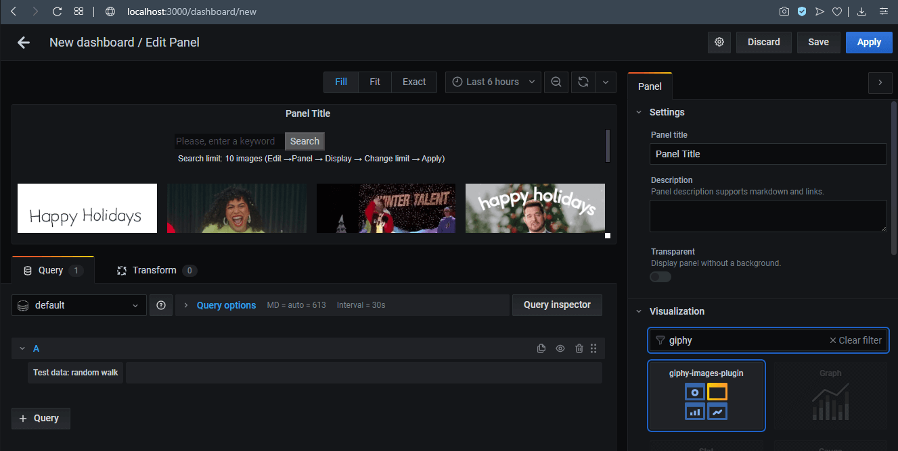
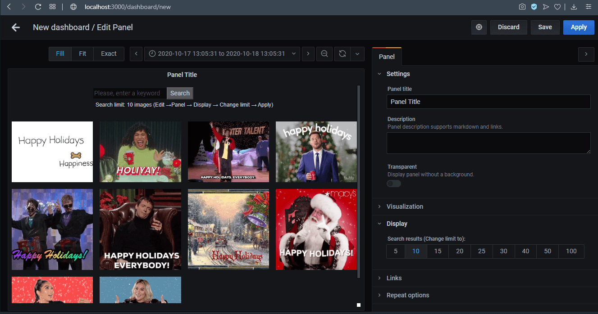
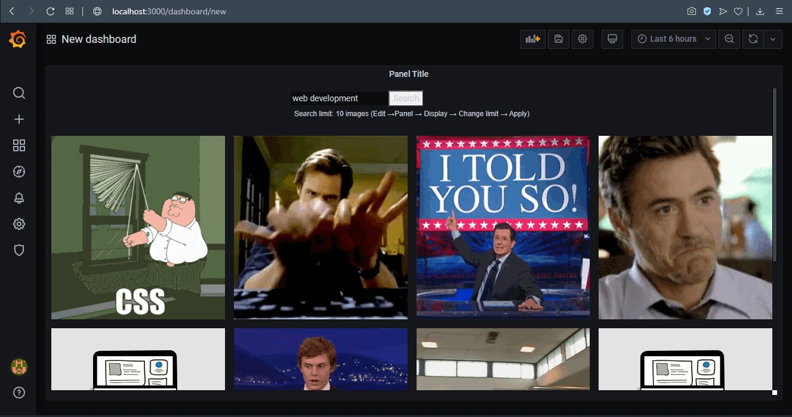

# Grafana Panel Plugin - Giphy Images 

Giphy images Fetched from [Giphy endpoint](https://developers.giphy.com/docs/api/endpoint/)

-------------------

## BUILD PLUGIN FOR DEPLOYMENT

In console run:
``` 
    npm run build
```
Check ```dist``` folder

-------------------

## Prerequisites
- Grafana 7.0 (required)
- NodeJS 12.x (required)
- yarn or npm (required)

Copy this plugin to Directory where grafana will automatically scan and look for plugins:
``` plugins = data/plugins ``` 

Restart the Grafana server for Grafana to discover your plugin.

Open Grafana and go to Configuration -> Plugins. Make sure that your plugin is there.

-------------------

In console run:
``` 
    npm i
    npm audit fix
    npm run jest
    npm run watch
```

Go to web-browser [localhost:3000](http://localhost:3000/)

- Create New Dashboard => Edit Panel => Visualization => Type: 'giphy' => Select Plugin => Push button: 'Apply'


- Change Search results output => Edit Panel => Display => Select one of the range: '5, 10, 15, 20, 25, 30, 40, 50, 100'  => Push button: 'Apply'


- Type into input field: 'Web Development' => Push button: 'Search' => Enjoy the result!


-------------------
